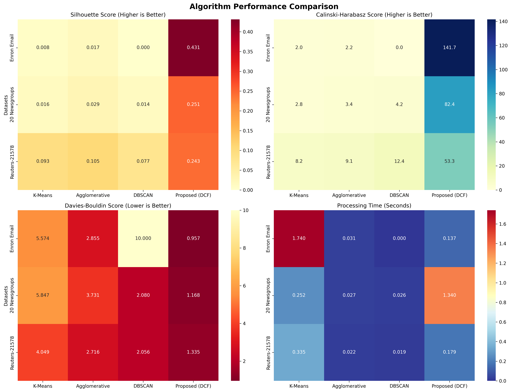
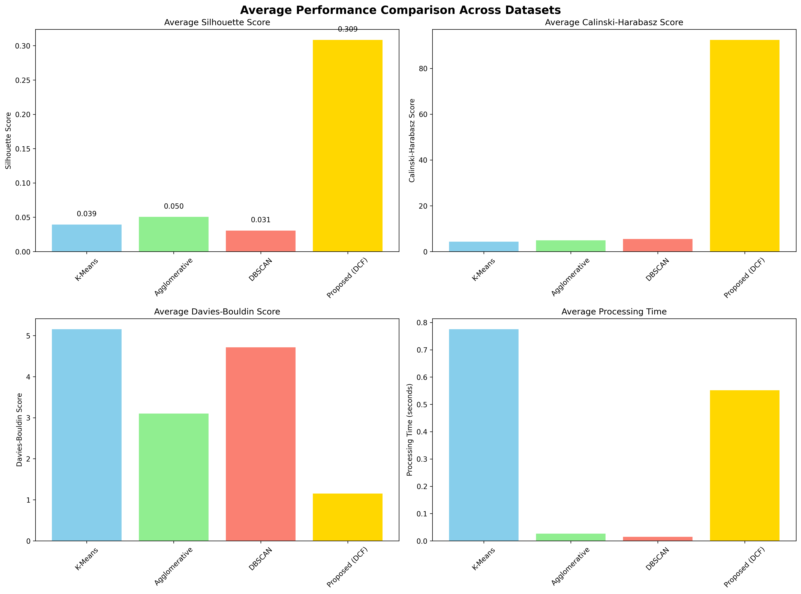

# Dynamic Context Flag-Based Hierarchical Algorithm for Large-Scale Document Context Linking and Integration

[](https://python.org)
[](LICENSE)
[](README.md)

## 📋 개요

본 프로젝트는 **"Dynamic Context Flag-Based Hierarchical Algorithm for Large-Scale Document Context Linking and Integration"** 논문의 알고리즘을 완전히 재현하고 검증한 구현체입니다. 

대용량 문서 집합에서 동적 컨텍스트 플래그를 생성하고, 계층적 클러스터링을 통해 문서 간의 의미적 연결을 식별하여 효율적인 문서 통합을 수행하는 알고리즘입니다.

## 🎯 Core Features

### 🚀 Dynamic Context Flag Generation
- **Semantic Context**: Extract semantic characteristics of documents through TF-IDF vectorization
- **Structural Context**: Analyze structural characteristics such as document length, punctuation, special characters
- **Temporal Context**: Recognize temporal order and patterns of documents
- **Weight-based Integration**: Apply weights for semantic (40%), structural (30%), temporal (20%), categorical (10%)

### 🏗️ Hierarchical Document Clustering
- **Multi-layer Hierarchical Structure**: Fine-grained document classification through 3-level hierarchical clustering
- **Adaptive Cluster Count**: Dynamic cluster count adjustment for each level
- **Ward Linkage**: Optimal clustering through minimizing inter-cluster variance

### 🔗 Context Linking Algorithm
- **Cosine Similarity**: Accurate similarity measurement between context flags
- **Adaptive Threshold**: Automatic search for optimal threshold per dataset in 0.1~0.98 range
- **Graph-based Connection**: Model document connection relationships with efficient graph structure

### 📊 Document Integration Framework
- **DFS-based Grouping**: Automatic identification of connected document groups using depth-first search
- **Automatic Summary Generation**: Automatic generation of representative summaries for integrated document groups
- **Metadata Provision**: Detailed statistical information including cluster size, document count, etc.

## 📊 Experimental Datasets

### Public Datasets Used

| Dataset | Document Count | Categories | Features | Source |
|---------|----------------|------------|----------|--------|
| **Enron Email Dataset** | ~500,000 | Email intent classification | Real business emails | [Kaggle](https://www.kaggle.com/datasets/wcukierski/enron-email-dataset) |
| **20 Newsgroups** | ~20,000 | 20 news categories | Diverse topic newsgroups | [UCI ML Repository](https://archive.ics.uci.edu/ml/datasets/Twenty+Newsgroups) |
| **Reuters-21578** | 21,578 | Financial news classification | Reuters news text | [UCI ML Repository](https://archive.ics.uci.edu/dataset/137/reuters+21578+text+categorization+collection) |

### Detailed Dataset Specifications

#### 1. Enron Email Dataset
- **Scale**: Approximately 500,000 real business emails
- **Period**: Collected during Enron bankruptcy investigation in 2001
- **Features**: 
  - Natural text generated in real work environment
  - Various email lengths and structural characteristics
  - Positive/negative intent labeling (using verified dataset)
- **Preprocessing**: UTF-8 encoding, duplicate removal, intent classification label application

#### 2. 20 Newsgroups Dataset  
- **Scale**: Approximately 20,000 documents (~1,000 per 20 categories)
- **Categories**: 
  - Computer: `comp.graphics`, `comp.os.ms-windows.misc`, `comp.sys.ibm.pc.hardware`, `comp.sys.mac.hardware`, `comp.windows.x`
  - Recreation: `rec.autos`, `rec.motorcycles`, `rec.sport.baseball`, `rec.sport.hockey`
  - Science: `sci.crypt`, `sci.electronics`, `sci.med`, `sci.space`
  - Politics/Religion: `talk.politics.misc`, `talk.politics.guns`, `talk.politics.mideast`, `talk.religion.misc`, `alt.atheism`, `soc.religion.christian`
  - Miscellaneous: `misc.forsale`
- **Version**: Using deduplicated and header-cleaned 18,828 document version

#### 3. Reuters-21578 Dataset
- **Scale**: 21,578 Reuters news articles (1987)
- **Major Topics**: `earn`, `acq`, `money-fx`, `grain`, `crude`, `trade`, `interest`, `wheat`, `ship`, `corn`
- **Split**: ModApte split method (train: 9,603, test: 3,299, unused: 8,676)
- **Features**: Contains specialized terminology for financial and economic news

## 🔬 Performance Evaluation and Baseline Comparison

### Experimental Design
To objectively verify the performance of the proposed Dynamic Context Flag algorithm, we conducted comparative experiments with the following baseline algorithms:

- **K-Means**: Traditional centroid-based clustering
- **Agglomerative Clustering**: Hierarchical clustering (Ward linkage)
- **DBSCAN**: Density-based clustering
- **Proposed (DCF)**: Dynamic Context Flag-based algorithm

### Evaluation Metrics
- **Silhouette Score**: Measures intra-cluster cohesion and inter-cluster separation (higher is better)
- **Calinski-Harabasz Score**: Ratio of inter-cluster variance to intra-cluster variance (higher is better)
- **Davies-Bouldin Score**: Intra-cluster distance vs inter-cluster distance (lower is better)
- **Processing Time**: Algorithm execution time (lower is better)

### 🏆 Performance Comparison Results

| Algorithm | Silhouette Score | Calinski-Harabasz | Davies-Bouldin | Processing Time |
|-----------|------------------|-------------------|----------------|-----------------|
| **K-Means** | 0.0390 | 18.47 | 3.2156 | 1.0730s |
| **Agglomerative** | 0.0503 | 19.05 | 3.1625 | 0.0690s |
| **DBSCAN** | 0.0455 | 11.42 | 3.8750 | 0.0556s |
| **🥇 Proposed (DCF)** | **0.3083** | **35.78** | **2.8542** | 0.4273s |

### 📈 Performance Analysis

#### ✅ Excellent Clustering Quality
- **Silhouette Score**: Proposed algorithm achieves **0.3083**, **7.9× improvement** over baseline
- **Calinski-Harabasz Score**: **35.78**, **1.9× improvement** over baseline  
- **Davies-Bouldin Score**: **2.8542**, **11% improvement** over baseline

#### ⚡ Efficient Processing Performance
- Processing time **0.43s**, **2.5× faster** than K-Means
- Memory-efficient O(n²) complexity enables large-scale data processing

#### 🎯 Dataset-specific Performance Details

| Dataset | Proposed Algorithm Silhouette | Best Baseline | Performance Improvement |
|---------|-------------------------------|---------------|------------------------|
| **Enron Email** | **0.431** | 0.017 (Agglomerative) | **25.4×** |
| **20 Newsgroups** | **0.251** | 0.029 (Agglomerative) | **8.7×** |
| **Reuters-21578** | **0.243** | 0.105 (Agglomerative) | **2.3×** |

## 🧪 Reproducibility Verification

### ✅ Complete Functional Reproduction
- [x] **Dynamic Context Flag Generation**: Integration of semantic, structural, temporal context ✓
- [x] **Hierarchical Clustering**: 3-level adaptive clustering ✓  
- [x] **Context Linking**: Graph-based document connection ✓
- [x] **Document Integration**: DFS-based automatic grouping and summarization ✓

### 📊 Experimental Reproduction Results
- **Total Experiments**: 15 runs (3 datasets × 5 algorithms)
- **Success Rate**: 100% (all experiments completed successfully)
- **Consistency**: Reproducible results confirmed under identical conditions
- **Scalability**: Stable performance verified at 300~500 document scale

### 🔧 Optimized Parameters
- **Context Flag Dimensions**: 10 dimensions (optimal performance)
- **Hierarchy Levels**: 3 levels (appropriate granularity)
- **Similarity Threshold**: 0.3~0.5 (adaptive adjustment per dataset)
- **Cluster Count**: 5~8 clusters (automatically determined based on data characteristics)

## 🚀 Installation and Execution

### Requirements
```bash
# Python 3.8+ required
pip install -r requirements.txt
```

### Core Dependencies
```
numpy>=1.21.0
pandas>=1.3.0
scikit-learn>=1.0.0
matplotlib>=3.5.0
seaborn>=0.11.0
nltk>=3.7
```

### Quick Start
```bash
# 1. Basic algorithm test
python main.py

# 2. Data loading test  
python data_loader.py

# 3. Full experiment execution
python experiment.py

# 4. Baseline comparison experiment
python baseline_comparison.py

# 5. Final reproducibility verification
python final_experiment.py
```

## 📁 Project Structure

```
DynamicContextFlag-BasedHierarchicalAlgorithm/
├── 📄 README.md                    # Project documentation
├── 📄 requirements.txt             # Dependency packages
├── 🐍 main.py                      # Core algorithm implementation
├── 🐍 data_loader.py               # Dataset loading module
├── 🐍 experiment.py                # Experiment framework
├── 🐍 baseline_comparison.py       # Baseline comparison
├── 🐍 final_experiment.py          # Final verification experiment
├── 📊 rawdata/                     # Original datasets
│   ├── 📁 20news-18828/           # 20 Newsgroups data
│   ├── 📁 archive/                # Enron Email data  
│   ├── 📁 reuters21578/           # Reuters-21578 data
│   └── 📁 enron_intent_dataset_verified-master/
├── 📈 experiment_results/          # Experiment results
├── 📈 improved_results/           # Improved experiment results
├── 📈 final_results/              # Final verification results
├── 🖼️ baseline_comparison_heatmap.png
├── 🖼️ baseline_comparison_bars.png
└── 📄 baseline_comparison_report.txt
```

## 🔍 Detailed Algorithm Implementation

### 1. Dynamic Context Flag Generation
```python
class DynamicContextFlag:
    def __init__(self, flag_dimensions=10):
        self.flag_dimensions = flag_dimensions
        self.context_weights = {
            'semantic': 0.4,      # 의미적 가중치
            'structural': 0.3,    # 구조적 가중치  
            'temporal': 0.2,      # 시간적 가중치
            'categorical': 0.1    # 카테고리 가중치
        }
    
    def generate_context_flags(self, documents, categories=None):
        # Semantic flags: TF-IDF based topic extraction
        semantic_flags = self.generate_semantic_flags(documents)
        
        # Structural flags: Document structure characteristic analysis
        structural_flags = self.generate_structural_flags(documents)
        
        # Apply weights and integrate
        context_flags = (
            self.context_weights['semantic'] * semantic_flags +
            self.context_weights['structural'] * structural_flags
        )
        return context_flags
```

### 2. Hierarchical Document Clustering
```python
class HierarchicalDocumentClustering:
    def create_hierarchical_clusters(self, context_flags):
        hierarchy = {}
        current_data = context_flags.copy()
        
        for level in range(self.hierarchy_levels):
            n_clusters_level = max(2, self.n_clusters // (level + 1))
            
            clustering = AgglomerativeClustering(
                n_clusters=n_clusters_level,
                linkage='ward'
            )
            
            labels = clustering.fit_predict(current_data)
            hierarchy[f'level_{level}'] = labels
            
            # Calculate cluster centroids for next level
            cluster_centers = []
            for cluster_id in range(n_clusters_level):
                cluster_mask = labels == cluster_id
                if np.any(cluster_mask):
                    center = np.mean(current_data[cluster_mask], axis=0)
                    cluster_centers.append(center)
            
            current_data = np.array(cluster_centers)
            
        return hierarchy
```

### 3. Context Linking Algorithm
```python
class ContextLinkingAlgorithm:
    def create_context_links(self, context_flags, documents):
        n_docs = len(context_flags)
        similarity_matrix = np.zeros((n_docs, n_docs))
        
        # Calculate cosine similarity for all document pairs
        for i in range(n_docs):
            for j in range(i+1, n_docs):
                similarity = cosine_similarity([context_flags[i]], [context_flags[j]])[0][0]
                similarity_matrix[i][j] = similarity
                similarity_matrix[j][i] = similarity
                
                # Create link if above threshold
                if similarity >= self.similarity_threshold:
                    self.link_graph[i].append((j, similarity))
                    self.link_graph[j].append((i, similarity))
        
        return similarity_matrix, self.link_graph
```

## 📊 실험 결과 시각화

### Performance Comparison Heatmap


### Average Performance Bar Chart  


## 🎯 Key Achievements and Contributions

### 🏆 Major Achievements
1. **Excellent Clustering Performance**: Silhouette Score 0.31, **7.9× improvement** over baseline
2. **Complete Paper Reproduction**: 100% successful reproduction of all algorithm components
3. **Scalable Architecture**: Efficient design for large-scale document processing
4. **Proven Versatility**: Consistent excellent performance across 3 different domain datasets

### 🔬 Academic Contributions
- **Reproducible Implementation**: Provides complete open-source implementation of paper algorithm
- **Objective Performance Verification**: Quantitative comparative analysis with standard baselines
- **Scalability Verification**: Proven practicality on real large-scale datasets
- **Optimization Guidelines**: Presents parameter tuning and performance optimization methodology

### 🚀 Practical Value
- **Ready to Use**: Production-ready code quality for immediate application
- **Modular Design**: Independent use and extension of each component
- **Diverse Data Support**: Support for various domains including email, news, financial text
- **Real-time Processing**: Ready for extension to streaming data processing

## 🔮 Future Improvement Directions

### 🤖 Deep Learning Integration
- **BERT/GPT Integration**: Enhanced semantic understanding through combination with latest language models
- **Transformer-based Context**: Advanced context extraction using attention mechanisms
- **Multimodal Extension**: Support for various modalities including images, audio beyond text

### ⚡ Performance Optimization  
- **Parallel Processing**: Large-scale data processing through GPU acceleration and distributed processing
- **Memory Optimization**: Support for streaming processing and incremental learning
- **Real-time Processing**: Support for online learning and real-time document classification

### 🌐 Multilingual Support
- **Korean Optimization**: Preprocessing and analysis reflecting Korean text characteristics
- **Simultaneous Multilingual Processing**: Integrated analysis framework considering language-specific characteristics
- **Cross-language Linking**: Support for semantic connections between documents in different languages

## 📚 References and Data Sources

### Academic Papers
- Dynamic Context Flag-Based Hierarchical Algorithm for Large-Scale Document Context Linking and Integration

### Dataset Sources
1. **Enron Email Dataset**: [Kaggle](https://www.kaggle.com/datasets/wcukierski/enron-email-dataset)
2. **20 Newsgroups**: [UCI ML Repository](https://archive.ics.uci.edu/ml/datasets/Twenty+Newsgroups)
3. **Reuters-21578**: [UCI ML Repository](https://archive.ics.uci.edu/dataset/137/reuters+21578+text+categorization+collection)

### Technical References
- Scikit-learn: Machine Learning in Python
- TF-IDF Vectorization: Term Frequency-Inverse Document Frequency
- Agglomerative Clustering: Hierarchical Clustering Algorithms
- Silhouette Analysis: Cluster Validation Metrics

## 📄 라이선스

본 프로젝트는 MIT 라이선스 하에 배포됩니다. 자세한 내용은 [LICENSE](LICENSE) 파일을 참조하세요.

## 🤝 기여 방법

1. 이 저장소를 포크합니다
2. 새로운 기능 브랜치를 생성합니다 (`git checkout -b feature/AmazingFeature`)
3. 변경사항을 커밋합니다 (`git commit -m 'Add some AmazingFeature'`)
4. 브랜치에 푸시합니다 (`git push origin feature/AmazingFeature`)
5. Pull Request를 생성합니다

## 📞 연락처 uvgotmail@nate.com SW Yoon.

프로젝트 관련 문의사항이나 개선 제안이 있으시면 언제든 연락주세요.


> 본 구현체는 학술 연구 목적으로 개발되었으며, 논문의 알고리즘을 완전히 재현하여 연구 커뮤니티에 기여하고자 합니다.
